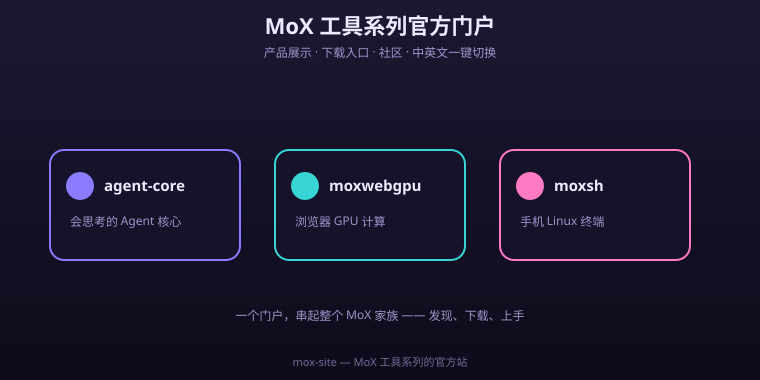

# mox-site

<p align="center">
  
  
  
  
  
</p>


The official portal for the **MoX series** (Chinese + English).

- Live site: https://codecloud-dev.github.io/mox-site/
- Bilingual: [`index.html`](index.html) (中文) · [`index.en.html`](index.en.html) (English)
- 中文 README: [`README.md`](README.md)

<p align="center"></p>

<p><b>⭐ If you like the MoX series, please give us a <a href="https://github.com/codecloud-dev/mox-site">star</a> — it helps more people discover these tools!</b></p>


## 🐛 Welcome to roast me

> This is an early-stage project — **bugs exist, and probably plenty of them.** I'm not pretending it's perfect.
> Every pitfall you hit and every gripe you have is a chance to help make it better.

- 💥 Crashed / black screen / won't run? → [File a bug report](https://github.com/codecloud-dev/mox-site/issues)
- 💡 Want a feature? → [Open a feature request](https://github.com/codecloud-dev/mox-site/issues)
- 🗯️ Just want to rant or nitpick? → Issues are welcome too, label it whatever 😄

I read every issue and fix what I can, fast. Let's grow this from "runs" to "delightful" 💪

<details>
<summary>📑 目录 · Contents</summary>

- [💡 What's inside](#whats-inside)
- [💻 Local preview](#local-preview)
- [🏠 Homepage sections](#homepage-sections)
- [🔹 Big-version upgrade (progress)](#big-version-upgrade-progress)
- [📜 License](#license)

</details>

## 💡 What's inside

A single static page (no build step) presenting **moxsh** — the liquid-glass terminal for Android. It is built as a self-contained `index.html` + `style.css` pair so it can be served straight from GitHub Pages.

Design notes:

- **Liquid-glass** surfaces: real-time blur, top specular highlight, refractive edge, pointer-following glow, and a slow-moving ambient sheen.
- **Device preview** that tilts with pointer / gyroscope for a real-device feel.
- **Human verification gate**: when a visit looks abnormal (headless / bot UA / missing capabilities), a slide-to-verify panel appears before the page — no quiz, just a gesture. Pass state is remembered for the session.
- **Support CTA**: a Star / follow / share prompt, because small indie projects live on visibility.

## 💻 Local preview

Open `index.html` directly, or serve the folder:

```bash
python3 -m http.server 8080
# then visit http://localhost:8080
```

Append `?verify=1` to the URL to force the verification gate for testing.

## 🏠 Homepage sections

The portal is more than a product list — it carries the three blocks that matter most to the project, all in `index.html` / `index.en.html`:

- **#roadmap**: a phased timeline of the MoX ecosystem (Phase 1–6), with explicit Shipped / In progress / Planned / TBD states — no empty promises.
- **#vision**: four core beliefs — desktop-grade power in your palm, compute pushed to your device, indie dev + AI together, open source & auditable.
- **#community**: GitHub org, Star, Issues, Afdian sponsorship, QQ group and email — all in one place.

## 🔹 Big-version upgrade (progress)

Every public repo moves to **1.0.0**, doing "a bit more, but leaving room" per its own roadmap.

| Repo | 1.0.0 deliverables | Status |
|:---:|---|:---:|
| **agent-core** | Universal agent framework: `MemoryStorage` / `NodeStorage` adapters, runnable examples, full dev docs + roadmap, npm-ready (OIDC no-token) | ✅ |
| **moxsh-plugins** | Unified schema key across `catalog.json` / `plugins.json`, `repoVersion` marker, new `glass-terminal-theme` example, JSON Schema validation, rewritten author guide | ✅ |
| **moxwebgpu** | Headline roadmap item **autograd** (reverse mode on the lazy graph), `expand` op, first npm publish, live demo + docs site | ✅ |
| **mox-site** | Added Roadmap / Vision / Community sections, bilingual portal upgrade, unified visuals | ✅ |
| **moxsh-terminal** | Perf (120Hz / atlas / NEON), on-device AI, `.mox` ecosystem, app icon unified to repo logo, version → 1.0.0 | 🔄 In progress |
| **moxsh-suite** | Bump submodule pointers (`app`=moxsh-terminal, `site`=mox-site) to 1.0.0; wrap-up | ⏳ Last |

> Planned · TBD **moxbox / moxcode** are out of scope for this big version; whether to proceed depends on actual releases.

## 📜 License

Same as the series: [GPL-3.0](../../LICENSE).
